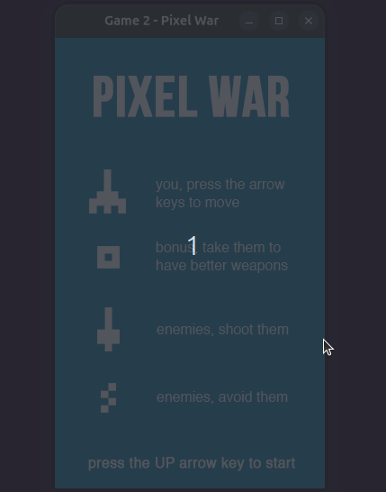

# Pixel War

## TODO
- Ajustar valores...
- Animação de explosão do inimigo com partículas (emitter do phaser)
- Animação de recuo do player quando ele atira (está suficiente? Não aparece no .gif)
- Rotação do rect do bônus (?)
