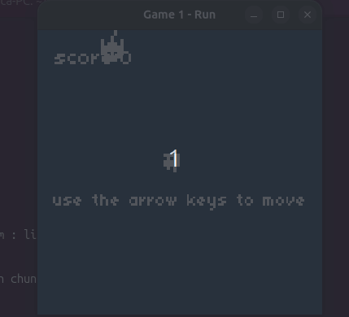

# Run

## TODO
- Ajustar valores (tempos e locais de spawn, posicionamento dos elementos)
- Rotação de rects (?)
- Criar efeito de fade out para o "use the arrow keys to move" (?)
- Trocar fonte para Arial (?)
